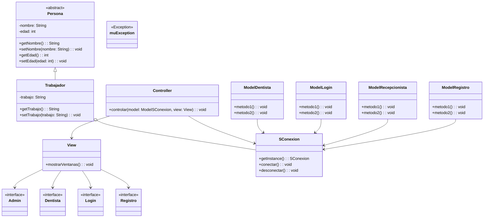

# RAMA Marcos


###  Ultimos cambios


    1- He hecho un método de prueba LogIn implementando el patron MVC  
    
Tras la prueba con el Log in, tengo que modificar el método del Model para que pueda haccer una descarga de los usuarios en un arrayList
y de esta manera en el controller, no tener que hacer otra llamada al get conexion.
Finalmente pode hacer la conexión con el usuario indicado a la base de datos

### Diagrama de clases:




### Diagrama de Secuencia del proyecto


````mermaid
sequenceDiagram
    participant View
    participant Controller
    participant SConexion
    participant Trabajador
    participant Persona

    View->>Controller: controlar(model, view)
    Controller->>SConexion: conectar()
    SConexion-->>Controller: instancia
    Controller->>View: mostrarVentanas()
    View-->>Admin: mostrarVentanas()
    View-->>Dentista: mostrarVentanas()
    View-->>Login: mostrarVentanas()
    View-->>Registro: mostrarVentanas()
    Controller-->>SConexion: desconectar()
    SConexion-->>Controller: instancia


````

### Observer
En la clase `SConexion` se implementa
`Observable`. De esta forma, cada vez que se elimina un registro, los métodos 
`setChanged()` y `notifyObservers()`, llamarán al método `update()`. Este último 
método está en la clase `ObservarRegistro` que es la que extiende de `Observer` y se
sobrescribe de tal forma que cada vez que se ejecuta se mande un mensaje al usuario
indicando que el registro se ha eliminado correctamente. 

