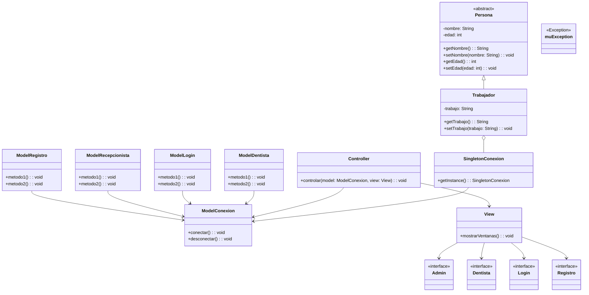

# RAMA Marcos


###  Ultimos cambios


    1- He hecho un método de prueba LogIn implementando el patron MVC  
    
Tras la prueba con el Log in, tengo que modificar el método del Model para que pueda haccer una descarga de los usuarios en un arrayList
y de esta manera en el controller, no tener que hacer otra llamada al get conexion.
Finalmente pode hacer la conexión con el usuario indicado a la base de datos

### Diagrama de clases:




### Diagrama de Secuencia del proyecto


````mermaid
sequenceDiagram
    participant View
    participant Controller
    participant ModelConexion
    participant Trabajador
    participant Persona
    participant SingletonConexion

    View->>Controller: controlar(model, view)
    Controller->>ModelConexion: conectar()
    ModelConexion-->>SingletonConexion: getInstance()
    SingletonConexion-->>ModelConexion: instancia
    Controller-->>ModelConexion: instancia
    Controller->>View: mostrarVentanas()
    View-->>Admin: mostrarVentanas()
    View-->>Dentista: mostrarVentanas()
    View-->>Login: mostrarVentanas()
    View-->>Registro: mostrarVentanas()
    Controller-->>ModelConexion: desconectar()
    ModelConexion-->>SingletonConexion: getInstance()
    SingletonConexion-->>ModelConexion: instancia


````

