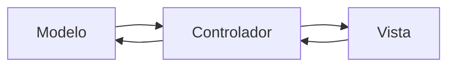

# Aplicación de Clínica Dental

Esta es una aplicación de clínica dental diseñada para la gestión de pacientes, citas, tratamientos y facturación. La aplicación se ha implementado siguiendo el patrón de diseño Modelo-Vista-Controlador (MVC) en Java.

## Arquitectura MVC

La aplicación sigue la arquitectura Modelo-Vista-Controlador (MVC) para separar las responsabilidades y facilitar el mantenimiento y la escalabilidad. A continuación se presenta un diagrama de la arquitectura MVC:



### Explicación del Diagrama de Arquitectura MVC:

- **Modelo (Model):** Representa los datos y la lógica de negocio de la aplicación. Contiene clases como `Paciente`, `Dentista`, `Cita`, `Tratamiento`, `Factura`, etc. que encapsulan los datos y los métodos relacionados con esas entidades. También interactúa con la capa de persistencia de datos.

- **Vista (View):** Es responsable de la presentación de los datos al usuario y de interactuar con él. Incluye las interfaces gráficas de usuario (GUI) que muestran la información al dentista, recepcionista o paciente. Se utilizan bibliotecas gráficas como Swing, JavaFX o AWT para construir las interfaces de usuario.

- **Controlador (Controller):** Actúa como intermediario entre el modelo y la vista, gestionando las interacciones y la lógica de flujo de la aplicación. Recibe las acciones del usuario desde la vista, realiza validaciones y actualiza el modelo y la vista según sea necesario.

## Diagrama de Clases

El siguiente diagrama de clases ilustra la estructura de las principales clases en la aplicación de clínica dental:

````mermaid
classDiagram
    class Paciente {
        +nombre: String
        +fechaNacimiento: Date
        +contacto: String
        +historialMedico: String
    }

    class Dentista {
        +nombre: String
        +especialidad: String
        +contacto: String
        +horariosDisponibles: List<Date>
    }

    class Cita {
        +fecha: Date
        +hora: Time
        +duracion: int
        +paciente: Paciente
        +dentista: Dentista
    }

    class Tratamiento {
        +nombre: String
        +descripcion: String
        +costo: double
        +realizar(): void
    }

    class Factura {
        +numero: String
        +fechaEmision: Date
        +montoTotal: double
        +estadoPago: String
    }

    class PacienteController {
        +registrarPaciente(paciente: Paciente): void
        +buscarPaciente(nombre: String): Paciente
        +programarCita(cita: Cita): void
        +generarFactura(factura: Factura): void
    }

    class DentistaController {
        +registrarDentista(dentista: Dentista): void
        +buscarDentista(nombre: String): Dentista
        +verHorariosDisponibles(dentista: Dentista): List<Date>
    }

    class CitaController {
        +buscarCita(fecha: Date, hora: Time): Cita
        +actualizarCita(cita: Cita): void
        +cancelarCita(cita: Cita): void
    }

    class PacienteDAO {
        +guardarPaciente(paciente: Paciente): void
        +buscarPaciente(nombre: String): Paciente
    }

    class DentistaDAO {
        +guardarDentista(dentista: Dentista): void
        +buscarDentista(nombre: String): Dentista
    }

    class CitaDAO {
        +guardarCita(cita: Cita): void
        +buscarCita(fecha: Date, hora: Time): Cita
    }

    class Vista {
        +mostrarInformacion(): void
        +solicitarDatos(): void
    }

    Paciente --> Cita
    Dentista --> Cita
    Cita --> Paciente: utiliza
    Cita --> Dentista: atendida por
    Tratamiento --> Cita: asignada a
    Factura --> Cita: generada para
    PacienteController --> Paciente
    PacienteController --> CitaController
    PacienteController --> Factura
    DentistaController --> Dentista
    DentistaController --> CitaController
    CitaController --> Cita
    PacienteDAO --> Paciente
    DentistaDAO --> Dentista

````

### Explicación del Diagrama de Clases:

- Se han identificado varias clases clave para el diseño de la aplicación, como `Paciente`, `Dentista`, `Cita`, `Tratamiento` y `Factura`. Estas clases contienen atributos y métodos relacionados con cada entidad.

- Las clases de controlador, como `PacienteController`, `DentistaController`, `CitaController`, se encargan de gestionar las interacciones entre la vista y el modelo. Estas clases manejan las acciones del usuario, realizan validaciones y actualizan los datos correspondientes.

- La capa de persistencia de datos, representada por las clases `PacienteDAO`, `DentistaDAO`, `CitaDAO`, se utiliza para almacenar y recuperar información relacionada con los pacientes, dentistas y citas.

## Requisitos del Sistema

La aplicación de clínica dental se ha desarrollado utilizando Java. A continuación se presentan los requisitos del sistema:

- Java Development Kit (JDK) 8 o superior instalado
- Bibliotecas gráficas (Swing, JavaFX, AWT) según sea necesario

## Instalación y Ejecución

1. Clona o descarga el repositorio de la aplicación de clínica dental.

2. Abre el proyecto en tu entorno de desarrollo Java preferido.

3. Compila el proyecto y asegúrate de que no haya errores de compilación.

4. Ejecuta la aplicación y sigue las instrucciones en la interfaz gráfica para utilizarla.

## Contribuciones

Las contribuciones a esta aplicación de clínica dental son bienvenidas. Si encuentras algún problema, tienes ideas para mejoras o deseas agregar nuevas características, puedes enviar una solicitud de extracción o abrir un problema en el repositorio.


### Observer
En la clase `SConexion` se implementa
`Observable`. De esta forma, cada vez que se elimina un registro, los métodos
`setChanged()` y `notifyObservers()`, llamarán al método `update()`. Este último
método está en la clase `ObservarRegistro` que es la que extiende de `Observer` y se
sobrescribe de tal forma que cada vez que se ejecuta se mande un mensaje al usuario
indicando que el registro se ha eliminado correctamente. 